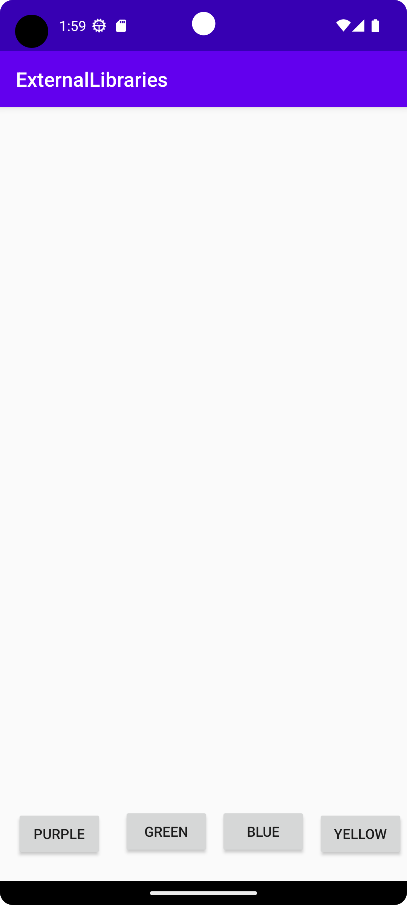
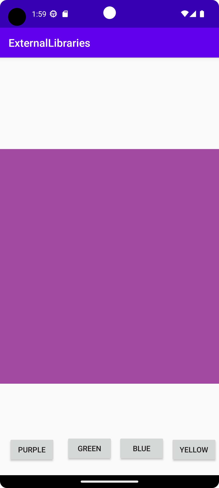
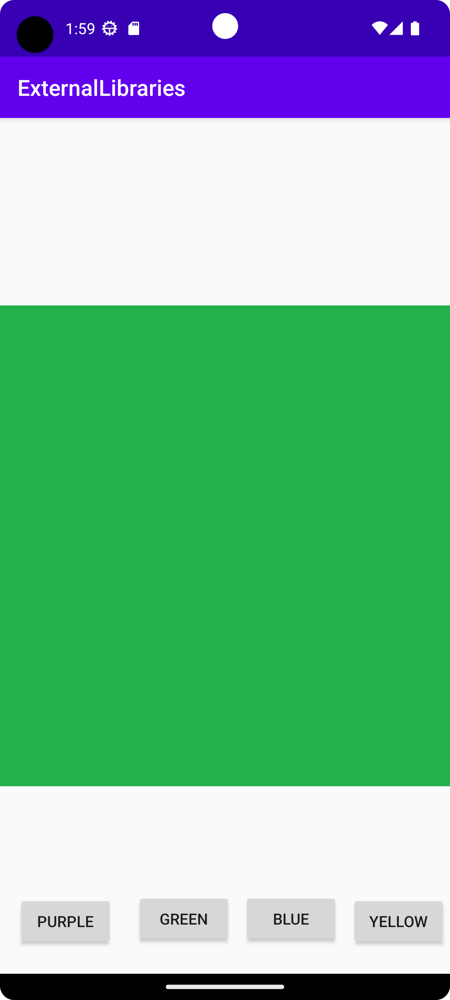
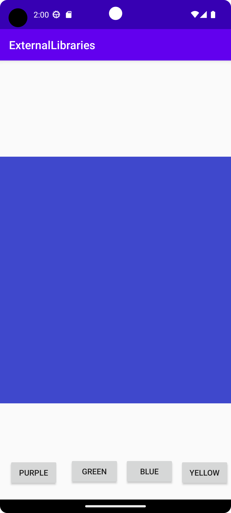
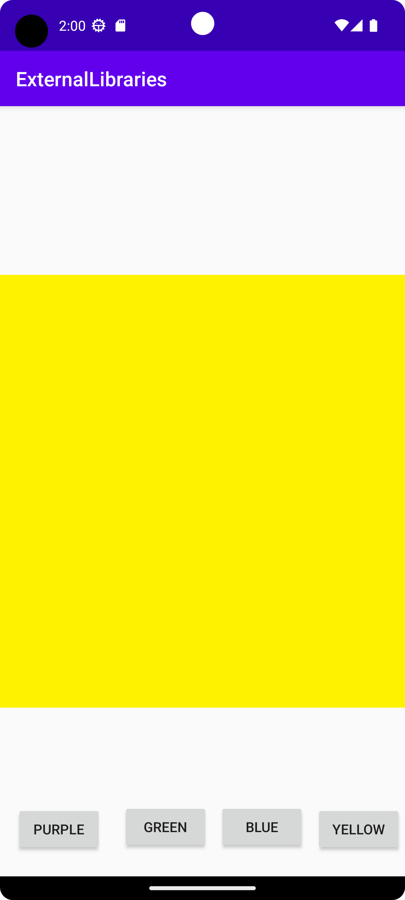

# Rapport

Detta projekt börjades med att jag försökte implementera Picasso biblioteket för att kunna hämta och visa bilder från internet.
Efter mycket strul med att kunna visa bilder med hög upplösning valde jag att testa Glide biblioteket.
Samma problem uppstod här också så jag valde att skapa egna låg upplösta bilder som jag laddade upp på näten.

I början av projektet så lade jag till dependancies för Glide, gav tillstånd för appen att använda internet och även alla Views (Knappar och ImageView) som appen behöver.
```
<uses-permission android:name="android.permission.INTERNET"/>
<uses-permission android:name="android.permission.ACCESS_NETWORK_STATE"/>
```
Efter detta skapade jag variabler för alla Views och kopplade ID't till dem med findViewByID(). 
Sedan skapade jag en onClickListener för alla 4:a knappar. Inom denna onClick metod så har jag lagt in 4 olika URL:er som sätts in i en string och skickas med som argument
till en metod som kallas.
```
button1.setOnClickListener(new View.OnClickListener() {
            @Override
            public void onClick(View v) {
                String URL = "https://i.imgur.com/gpyUO76.png";
                newImage(URL);
            }
        });
```

Till sist har jag skapat en metod som använder sig av Glide biblioteket. 
För att få bilderna att visas måste man skapa en ImageView och koppla en imageView variabel till den.
Sedan anger man vilken URL som ska hämtas och inom vilken ImageView den ska visas på.

```
public void newImage(String url) {
    Glide.with(this).asBitmap().load(url).override(1000, 1000).into(imgV);

}
```








